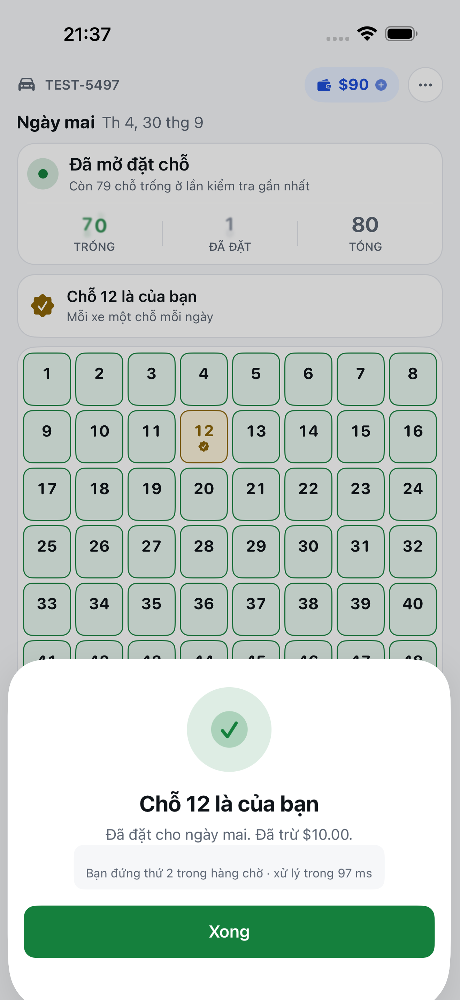
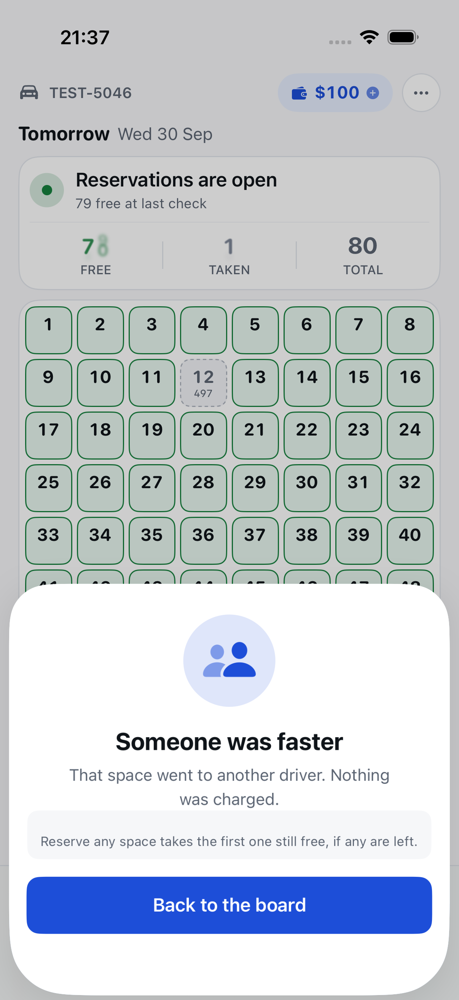

# Parking Space Reservation — iOS Client
## Final Checkpoint

Native iOS client for the Parking Space Reservation System.
Same format as the week-1 deck ([`../slides.md`](../slides.md)). Speaker notes:
[`speaker-notes.md`](speaker-notes.md). Live demo, step by step: [`demo-script.md`](demo-script.md).

---

## Agenda — 60 minutes

| Part | Minutes | What |
|---|---|---|
| A. Architecture | 10 | The problem, the shape of the client, the decisions that carry it |
| B. Live demo | 20 | The interface and its state matrix, then the races |
| C. Security, CI, AI | 10 | What protects the user, what protects the code, how AI was used |
| D. Questions | 20 | Trade-offs, and what changes at production scale |

---

## Where it landed

- **Every Guardrail met; every Default kept, or swapped and the swap built.** None left
  neither kept nor replaced. Certificate pinning was the last, built on day 8.
- **Stretch items built:** Swift 6 language mode, clock-skew warning, iPad *and* landscape, a
  second locale (Vietnamese), the race rehearsals, an Instruments trace, three Claude Code skills.

| | |
|---|---|
| App | 28 Swift files, 4,764 lines, **zero third-party dependencies** |
| Tests | **123 unit** · **26 UI**: 13 in CI on fakes, 13 live-only (pinning, rehearsals, screenshots) |
| Gates | SwiftLint 0 violations · zero warnings under Swift 6 · String Catalog in sync, 150 keys |
| CI | Self-hosted runner, every push: lint, build, strings, unit, UI, archive — green on head |
| Evidence | 7 ADRs · 11 defects reported (1 in the brief, 10 in the backend) |

---

## What changed since week 1

| Raised at the checkpoint | Done |
|---|---|
| The "We're not sure yet" sheet read as distressing | Three distinct uncertain outcomes, each saying where the money stands |
| A deposit moved money without Face ID | Every money movement prompts, and the prompt names the amount |
| Picking a space was the only way to reserve | "Reserve any space": the option most likely to win |
| Free spaces showed a stranger's plate | Fixed in the model type (D9), so no view can show one |
| Idempotency: ask the backend team? | **Approved.** Client key + replay + read-back, built on a backend branch |
| Certificate pinning: a written risk, or built? | **Built** and demonstrated refusing a wrong pin |

---

# A. Architecture

---

## The problem, measured before designing

1,000 virtual users against the real backend at 20:00:

| | |
|---|---|
| Reservations | **80 of 1,000** — 92% of users lose |
| Duplicates, over-charges | 0 · 0 — $800.00 taken, exactly 80 × $10 |
| Latency | p95 **248 ms**, p99 368 ms, max 867 ms |

Two consequences drove the design:

- **Losing is the normal experience**, so it gets the same design care as winning.
- **A lost reply is not a lost race.** A timeout leaves the outcome unknown, and the app must
  never claim what it cannot prove.

---

## The shape of the client

```
Features   SwiftUI views + @MainActor view models      (GridViewModel, OutcomeSheet, …)
   │
Domain     ReservationCoordinator (actor) · ServerClock (actor) · error taxonomy
   │       protocols only — imports Foundation, nothing else
Data       HTTPClient · certificate pinning · Keychain · Face ID
```

- One composition root (`AppEnvironment`); every service behind a protocol, faked in tests.
- Swift 6 language mode, `-strict-concurrency=complete`, warnings as errors.
- XcodeGen: `project.yml` is the source of truth; the `.xcodeproj` is not committed.

---

## The decisions that carry it — 7 ADRs

| ADR | Decision | Because |
|---|---|---|
| 001 | Three layers, no dependencies, Swift 6 | Every dependency is supply-chain surface; none saved enough |
| 002 | Never claim a reservation the client cannot prove | A timeout's outcome was unknowable; pessimistic UI, four outcomes |
| 003 | Classify errors on the payload, not the status | `WINDOW_CLOSED` is a 429; a wrong password and a dead session are both 401 |
| 004 | Server time from the `Date` header; a 5 s poll | No time endpoint; device clocks can be changed |
| 005 | All 80 cells on a 6.1-inch screen, measured | The Guardrail, asserted from the running app, not a model |
| 006 | Keychain, Face ID on every money move, pinning | The session and the wallet are the assets |
| 007 | Repeat a tap's Idempotency-Key, then read back | Makes a lost reply recoverable instead of unknowable |

---

## The hardest problem: a reply that never arrives

**Before (week 1).** Idempotency keyed by the server on (user, date); a retry answered
`DUPLICATE_REQUEST` for both *still running* and *already succeeded*. So the app never retried,
matched its plate suffix on the board, and often had to say *"still checking"*.

**After (approved change, ADR-007).**

1. One UUID per tap, sent as `Idempotency-Key`.
2. A timeout repeats **the same key**: the server replays the first outcome instead of
   running a second attempt, or answers `IDEMPOTENCY_IN_PROGRESS`.
3. Still unresolved: `GET /reservations/me` reads back what committed.
4. Only if the server is unreachable does the board get consulted, as before.

Backend: Redis for the hot path, Postgres as the authority (the key is written in the same
transaction as the $10). 23 integration tests; each database fallback mutation-checked.

---

# B. Live demo — 20 minutes

---

## What you will see

| # | Segment | Driven by |
|---|---|---|
| 1 | The board, the 20:00 countdown, English and Vietnamese | The app on the simulator |
| 2 | The state matrix: win, lose, lot full, no balance, offline, three kinds of *unknown* | The app, and in-process fakes for the unknowns |
| 3 | The gate proved on, then a **won** race, a **lost** race, the **backend killed** mid-reservation | `make rehearse`, checked against the database |
| 4 | **Two users confirm the same space at the same instant** | `make concurrent`, two simulators |
| 5 | A wrong certificate pin, refused before anything is sent | `make pinning-demo` |

Every result is checked against the database, not only the screen.

---

## Two users, one space, the same instant

<p>


</p>

- **API:** both requests released from a barrier, median 32 µs apart. **20 of 20** trials: one
  winner, one `SPACE_UNAVAILABLE`, one $10 debit; the winner split **10–10**. With "any space",
  20 of 20 gave both users a space, never the same one.
- **App:** two simulators tapped Confirm **0 ms apart**. One *"is yours"*, one *"someone was
  faster, nothing was charged"* — and the loser's board already shows the winner's plate.

---

## The races, rehearsed and verified

| Rehearsal | The app says | The database confirms |
|---|---|---|
| Gate | — | `429 WINDOW_CLOSED` outside the window: the gate is on, not bypassed |
| Won | *"Space 12 is yours"* | Booked; balance 90.00 |
| Lost | *"Someone was faster"* | The rival holds space 12; the user uncharged |
| Killed | *"Still checking — the connection dropped"* | After restart: nothing booked or charged, as the sheet said |

Two rounds back to back, unattended (`ROUNDS=2 make rehearse`). The kill is a real crash: a
database lock holds the request inside the server, then `SIGKILL`.

---

# C. Security, CI and AI — 10 minutes

---

## Security

- **Session** in the Keychain, `WhenUnlockedThisDeviceOnly`. **Face ID** before every money
  movement, naming the amount; passcode fallback.
- **Certificate pinning:** chain must validate **and** carry a pinned SPKI hash; CA key as a
  backup pin so the server key can rotate. A wrong pin is refused in the handshake.
- **Checked, not assumed** (day 8): the whole git history, the release bundle, the logs (the
  app has none), the URL cache after a live session, CI.
- **Found and fixed:** the UI-test environment, with an always-yes Face ID, was compiled into
  release builds. Now debug-only; the release binary re-inspected.
- **Reported, not fixable here:** the backend commits its JWT signing key (D10); a crash
  mid-reservation locks that user out for the day (D11).

---

## Testing and CI

| Layer | What it proves |
|---|---|
| 123 unit tests | Domain and view models, on fakes: races, retries, clock, error shapes, pinning |
| 13 UI tests in CI | Login → board → reserve, the uncertain sheets, the 6.1-inch guardrail (EN + VI), an accessibility audit in light, dark and the largest text |
| Live suites | Rehearsals, concurrency, pinning, the Instruments trace — run by scripts |
| Gates | Lint 0 · no warnings · catalog in sync · mutation checks on the tests that matter |

Performance (`make trace`): ~1% of one core idle on the board; the worst moment, all 80 cells
changing in one poll, is a **25 ms** main-thread burst — one frame. No hangs.

---

## How I applied AI

- **Working agreement** (`CLAUDE.md`): origin grants no exemption; the same six gates; hard
  limits on what may reach an AI tool in a banking context.
- **Where it helped:** reading the backend's source in an hour, drafting tests and scaffolding,
  running the audits and the rehearsals end to end.
- **Where it failed, on the record** (`docs/ai-workflow.md`), for example:
  - a no-op tap-target fix with a test that passed without it — caught by a mutation check
  - a comment claiming the Face ID bypass was compiled out; `strings` on the binary disagreed
  - a trace that measured the test driver, not the app
- **Measuring contribution:** a per-commit `AI-Assisted` trailer, correlated with defects and
  review round-trips — never a leaderboard.

---

# D. Questions — 20 minutes

---

## Trade-offs I would defend

- **Pessimistic reservation, not optimistic.** An optimistic cell would be wrong 92% of the time.
- **Polling, not push.** The backend offers no push; a 5 s poll costs ~nothing idle and is
  matched to the server's cache. Push/SSE is the first production change (`design.md` §7).
- **Four retries of one key, a second apart.** Recovers a lost reply without adding load in the
  one minute the server can least afford it.
- **Pin the server key with a CA backup.** Survives renewal and rotation without a release.

## What changes at production scale

- Push instead of polling · the backend fixes D10 and D11 · pins shipped in the build with
  monitored expiry · pin-failure and outcome telemetry · a VoiceOver pass by a person and a
  native-speaker review of the Vietnamese.

---

## Open, and said plainly

- A UI-test first tap is sometimes lost on the iOS 26.3 simulator; the cause is not found. A
  guarded re-tap keeps CI green; it has not been seen on a real device.
- The Vietnamese is machine-drafted, and no person has yet made a VoiceOver pass.
- The idempotency backend lives on a local branch: the account has no push access upstream.

---

## Thank you — questions

Repository: `parking-ios` · Design: `docs/design.md` · Decisions: `docs/architecture.md` ·
Defects: `docs/defects.md` · Security: `docs/security.md` · Runbook: `docs/runbook.md`
